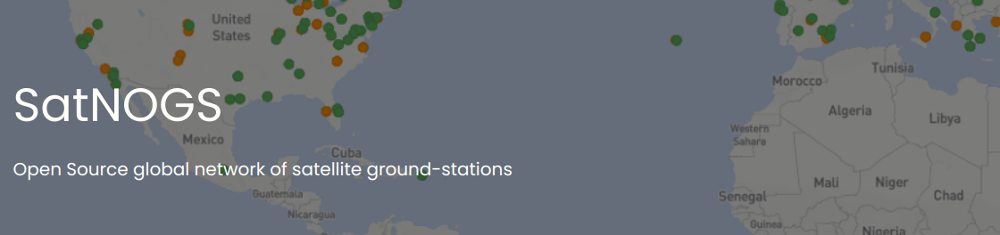
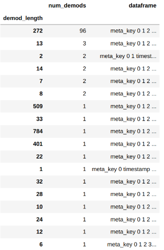
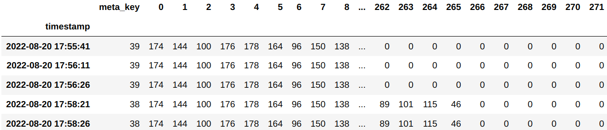
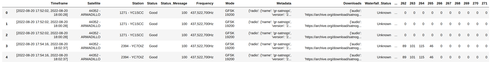
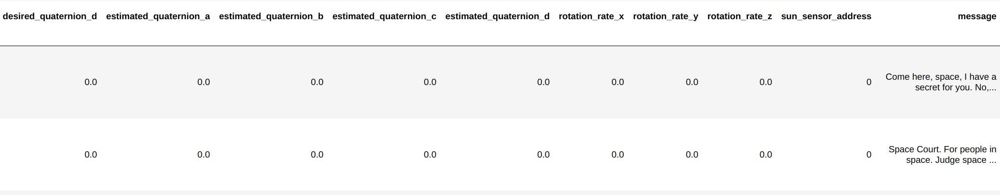

# satnogs-webscraper-v2



## Overview

SatNOGS is a crowd sourced network of satellite groundstations the collect satellite telemetry. SatNOGS primarily collects
telemetry from small cubesats that emit telemetry signals in UHF and VHF. The data collected by the SatNOGS community is very high
quality and could be a boon for data science projects.

This project is a webscraper the scrapes data off of the public facing website and aggregates the data into pandas
dataframe for data science applications.

## Setup

To install the webscraper, just use the following command:
```commandline
pip install satnogs-webscraper
```

## Quick Start

This section demonstrates how to aggregate some observations and look at a dataframe.

Start by importing the library. The convention is to import the scraper as sw.

```python
import satnogs_webscraper as sw
```

Next, create the scraper object with a configuration for the pages it should scrape. In the example below, we set the 
norad to be `44352`, set the page limit to `2`, and set the data flag to `1`. The norad field is used by the script to
identify observations of the satellite of interest. The page limit field is to limit the "pagnation" the script traverses. One
page results in 20 observations. Setting `data=1` ensures that only observations with demodulated data are scraped. 

```python
scraper = sw.Scraper(data=1, norad="44352", list_page_limit = 2)
```

Finally, call the `scrape` method to get the metadata dataframe and the demodulated dataframe.

```python
meta_df, demod_df = scraper.scrape()
```

The `demod_df` is a dataframe of dataframes. The demod dataframe itself is indexed on the length of the demods and contains
a column for the number of occurrences of demods of that length. This is depicted in the image below. 



To get the the dataframe of 96 demods that are 272 bytes in length, just use the following command:

```python
demod_272 = demod_df.loc[272].dataframe
```

This dataframe will be indexed on the timestamp associated with the demod. The dataframe will have `1` to `n` columns, with
each column capturing a single byte of the demod. Lastly, the `meta_key` is a key to the `meta_df` dataframe that can be used
for sourcing and attribution of the demod.



The code snippet below contains of all the code used in this section.

```python
import satnogs_webscraper as sw
scraper = sw.Scraper(data=1, norad="44352", list_page_limit = 2)
meta_df, demod_df = scraper.scrape()
demod_272 = demod_df.loc[272].dataframe
```

## Script Examples

This section consists of a few code recipes and examples that could be useful for working the web scraper.

### Filtering on Metadata
This subsection provides a recipe for filtering demod data using the metadata. In this example, the demods will be filtered
to only those collected by _EU1AEM_.

```python
# Imports and Scraper Setup
import satnogs_webscraper as sw
scraper = sw.Scraper(data=1, norad="59112", list_page_limit = 1)
# Get the Dataframes
meta_df, demod_df = scraper.scrape()
# Filter for the station
filtered_meta = meta_df[meta_df['Station'].apply(lambda x: x.find("EU1AEM") != -1)]
# Create the list of meta_keys
keys = set(filtered_meta['meta_key'])
# apply the filter on a demodulated dataframe.
demod_146 = demod_df.loc[146].dataframe
demod_146 = demod_146[demod_146['meta_key'].apply(lambda x: x in keys)]
```

__Explaination__: Start by importing the module and creating the scraper object. Next run the `scrape` method to get 
the dataframes. After that, filter the metadata dataframe to only entries that have the string `"EU1AEM"`. Convert the 
keys to a deduplicated set. Finally, use that set to filter the demodulated data.


### Combining Demod data and Metadata

This subsection provides a recipe for combining a demod dataframe and its associated metadata.

```python
# Imports and Scraper Setup
import satnogs_webscraper as sw
import pandas as pd
scraper = sw.Scraper(data=1, norad="59112", list_page_limit = 1)
# Get the Dataframes
meta_df, demod_df = scraper.scrape()
# Extract a demod dataframe
demod_272 = demod_df.loc[272].dataframe
# Use a right join to merge the dataframes.
result = pd.merge(meta_df, demod_272, on = 'meta_key', how='right')
```
__Note__: A right join is used here due to the one-to-many relationship between `meta_df` and `demod_272`.

The image below captures the dataframe after the merging.



### Using a Kaitai Struct Parser During Download

The scraper supports parsing demodulated data using kaitai struct during data download.

__Note__: This recipe uses [armadillo.ksy]() that was compiled on the local machine using `kaitai-struct-compiler`

```python
# Import the scraper and the kaitai module.
import satnogs_webscraper as sw
from armadillo import Armadillo # imported after compiling the ksy file.
# Create the scraper with the kaitai object and scrape
scraper = sw.Scraper(data=1, norad="44352", list_page_limit = 1, kaitai_interface=Armadillo)
meta_df, demod_df = scraper.scrape()
```

This will create a new column in the `meta_df` dataframe called __kaitai__. 

This snippet will show an example of extracting the first kaitai object of each row.

```python
# First filter out observations that do not have kaitai objects
meta_df = meta_df[meta_df['kaitai'].apply(len) > 0]
# Next define a helper function to parse the kaitai object and add the key/value pairs to the dataframe
def enumerate_payload(row):
    first_kaitai_object = row['kaitai'][0]
    for attr, value in first_kaitai_object.ax25_frame.payload.data_payload.__dict__.items():
        row[attr] = value
    return row
# Finally, apply the function to the dataframe. 
meta_df = meta_df.apply(enumerate_payload, axis = 1)
```

Executing this snippet should leave the dataframe with these columns.
```python
['Timeframe', 'Satellite', 'Station', 'Status', 'Status_Message',
       'Frequency', 'Mode', 'Metadata', 'Downloads', 'Waterfall_Status',
       'Polar_Plot', 'demods', 'meta_key', 'kaitai', '_io', '_parent', '_root',
       'pb_magic', 'time_since_epoch', 'uptime', 'avail_nvmem', 'pos_x',
       'pos_y', 'pos_z', 'vel_x', 'vel_y', 'vel_z', 'pwr_states_reserved',
       'gps_power', 'adc_power', 'antenna_power', 'pdd_power',
       'spacecraft_mode', 'vbatt', 'input_current', 'output_current',
       'boot_count', 'boot_cause', 'eps_temp_1', 'eps_temp_2', 'eps_temp_3',
       'eps_temp_4', 'eps_bp4a', 'eps_bp4b', 'eps_output_1_current',
       'eps_output_2_current', 'eps_output_3_current', 'eps_output_4_current',
       'eps_output_5_current', 'eps_output_6_current', 'rxwl_temp_x',
       'rxwl_temp_y', 'rxwl_temp_z', 'gyro_temp_x', 'gyro_temp_y',
       'gyro_temp_z', 'desired_quaternion_a', 'desired_quaternion_b',
       'desired_quaternion_c', 'desired_quaternion_d',
       'estimated_quaternion_a', 'estimated_quaternion_b',
       'estimated_quaternion_c', 'estimated_quaternion_d', 'rotation_rate_x',
       'rotation_rate_y', 'rotation_rate_z', 'sun_sensor_address', 'message']
```

A screenshot of these later columns is shown below.



__Note__: A lot of warnings can be generated during processing with kaitai struct and demods that fail to decode. These can 
be surpressed with:

```python
import warnings
warnings.filterwarnings('ignore')
```